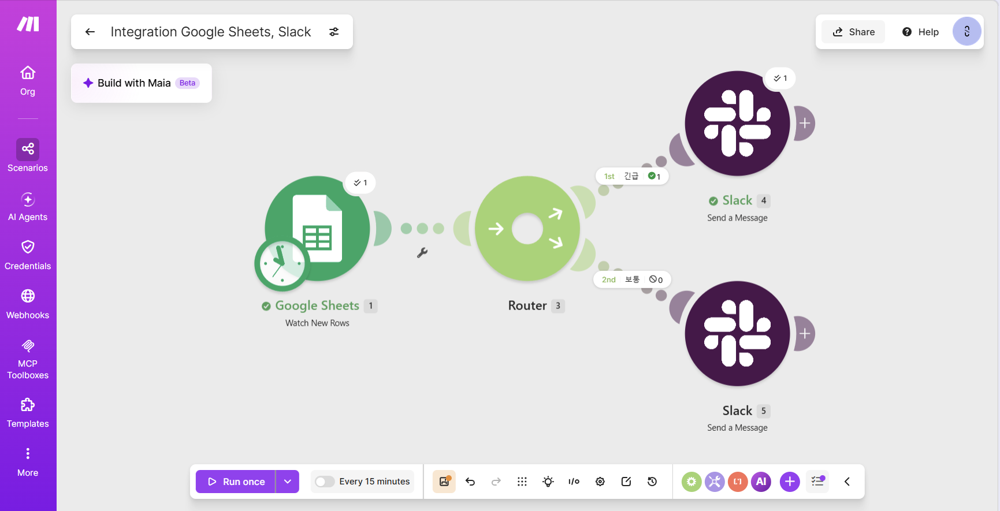
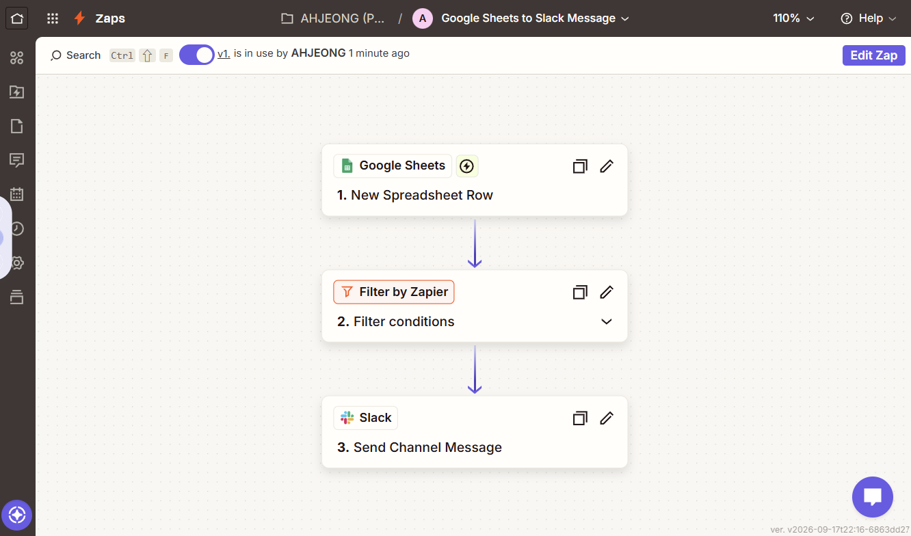
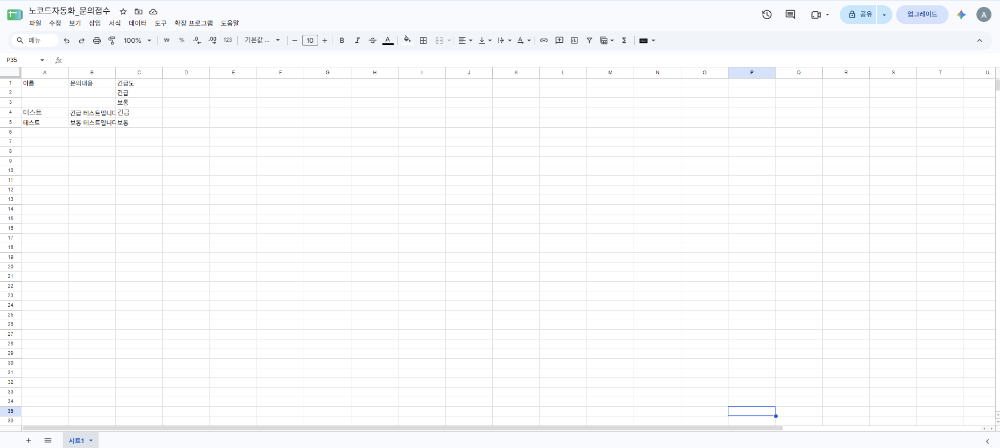
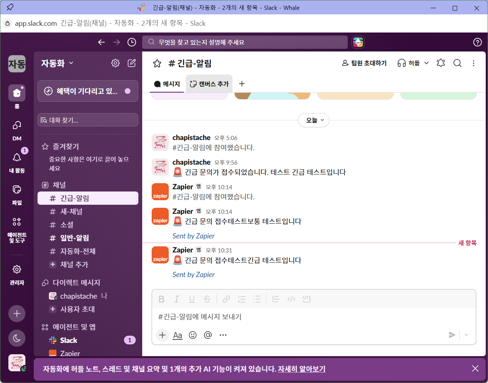
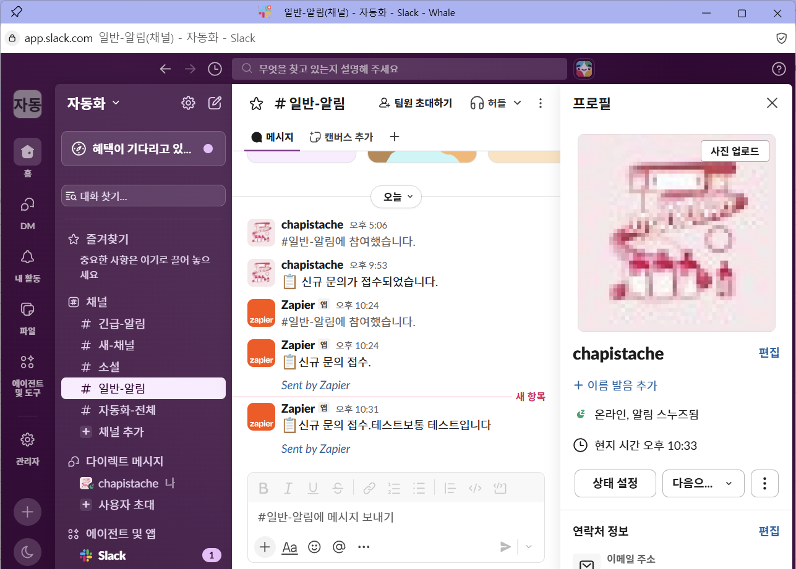

# 프로젝트 1: 자동화 도구 비교 구현 (Make vs Zapier)

## 워크플로우 개요

- **주제**: 문의 접수 시트에 신규 행이 추가되면, 긴급도에 따라 다른 슬랙 채널로 알림을 보낸다.
- **Trigger**: Google Sheets 신규 행 추가 감지
- **조건 분기 (Router/Filter)**: "긴급도" 열 값이 "긴급"인지 "보통"인지에 따라 경로 분기
- **Action A**: 슬랙 `#긴급-알림` 채널로 메시지 전송
- **Action B**: 슬랙 `#일반-알림` 채널로 메시지 전송

두 도구 모두 **동일한 구글 시트("노코드자동화_문의접수")**를 공통 데이터 소스로 사용했다.

---

## [Make 구현]

### 구성
- Trigger: `Google Sheets – Watch New Rows`
- Router: 2개 경로로 분기
  - 1st 경로: 필터 조건 `긴급도 = 긴급`
  - 2nd 경로: 필터 조건 `긴급도 = 보통`
- Action 1: `Slack – Send a Message` (`#긴급-알림` 채널)
- Action 2: `Slack – Send a Message` (`#일반-알림` 채널)

### 구성 화면 & 실행 결과
Router가 긴급/보통 두 경로로 나뉘어 있고, 각 모듈 우측 상단의 `✓1` 표시로 두 경로 모두 최소 1회 이상 정상 실행되었음을 확인할 수 있다.

**긴급 경로 → `#긴급-알림` 채널**

**보통 경로 → `#일반-알림` 채널**

---

## [Zapier 구현]

### 구성
- Trigger: `Google Sheets – New Spreadsheet Row`
- Filter: `Filter by Zapier`
  - 긴급 알림용 Zap: `긴급도 Exactly matches 긴급`
  - 일반 알림용 Zap: `긴급도 Exactly matches 보통`
- Action: `Slack – Send Channel Message`

무료 플랜에서는 하나의 Zap 안에서 분기(Paths)가 제한적이라, **동일한 트리거를 가진 Zap 2개**를 만들어 필터 조건만 다르게 설정해 조건 분기를 구현했다.

### 구성 화면 & 실행 결과

**구글 시트에 입력된 테스트 데이터**

**긴급 경로 → `#긴급-알림` 채널**

**보통 경로 → `#일반-알림` 채널**

---

## 비교 분석표

| 비교 항목 | Make | Zapier |
|---|---|---|
| UI/UX | 시각적 노드(캔버스) 기반. 모듈 간 연결과 데이터 흐름이 그래프로 한눈에 보임 | 세로 리스트/카드 기반. 단계가 위에서 아래로 순차 표시됨 |
| 설정 난이도 | Router, 필터 아이콘 등 초반에 UI 요소를 찾는 데 다소 시간이 걸림 | 단계별로 Setup → Configure → Test 순서가 명확해 처음 사용자도 따라가기 쉬움 |
| 조건 분기 구현 방식 | 하나의 시나리오 안에서 Router로 N개 경로를 한 번에 분기 가능 | 무료 플랜에서는 Paths 대신 Zap을 경로 수만큼 따로 만들어야 해서 관리 포인트가 늘어남 |
| 연동 서비스 범위 | Google Sheets, Slack 등 주요 서비스 연동 모두 지원 | 마찬가지로 광범위하게 지원 |
| 무료 플랜 범위 | 월 1,000 Operations | 월 100 Tasks, Zap 개수도 제한적 |
| 실행 로그 확인 방식 | 캔버스에서 각 모듈 아이콘 위에 성공 횟수(✓1)가 바로 표시되고, 클릭하면 입출력 데이터까지 확인 가능 | Zap history 메뉴에서 실행 목록 확인, Filter 단계는 "Items that didn't match"로 필터링 이유를 보여줌 |
| 테스트 방식 | Run once로 즉시 실행 대기 상태를 만들고 반응 수 초 이내 확인 가능 | Test trigger/Test step으로 단계별 테스트 가능하나, 실제 자동 실행은 폴링 주기(수 분) 대기 필요 |

## 장단점 정리

### Make
- **장점**: 하나의 캔버스에서 전체 흐름과 분기 구조가 시각적으로 파악되고, Router로 여러 경로를 한 시나리오 안에서 관리 가능. 테스트 반응 속도가 빠름.
- **단점**: 처음 접했을 때 아이콘(필터 깔때기 등)의 의미를 직관적으로 파악하기 어려운 부분이 있음.

### Zapier
- **장점**: 각 단계가 Setup → Test 순서로 명확히 구분되어 초보자가 헷갈리지 않음. 필터 테스트 시 실패 사유를 친절하게 알려줌.
- **단점**: 무료 플랜에서는 하나의 흐름 안에서 분기를 만들기 어려워 Zap을 여러 개 만들어야 해서 관리가 번거로움. 폴링 주기 때문에 결과 확인까지 대기 시간 발생.

## 어떤 상황에 적합한가

분기가 여러 개이거나 워크플로우가 복잡해질 가능성이 높다면 **Make**가 하나의 캔버스에서 전체 구조를 관리하기 편하다. 반대로 단순한 자동화를 빠르게 붙이고 싶거나 처음 접하는 팀원이 많다면 **Zapier**의 순차적 UI가 더 적합하다.

## 사용한 유료 기능 여부
- [x] 없음 (Make, Zapier 모두 무료 플랜 범위 내에서 완수)

---
전체 화면과 함께 정리된 버전은 [`report.pdf`](./report.pdf)에서도 확인할 수 있습니다.
