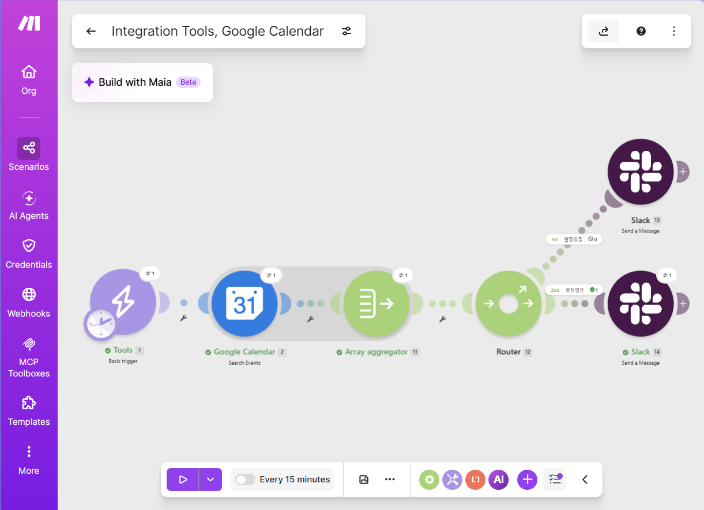
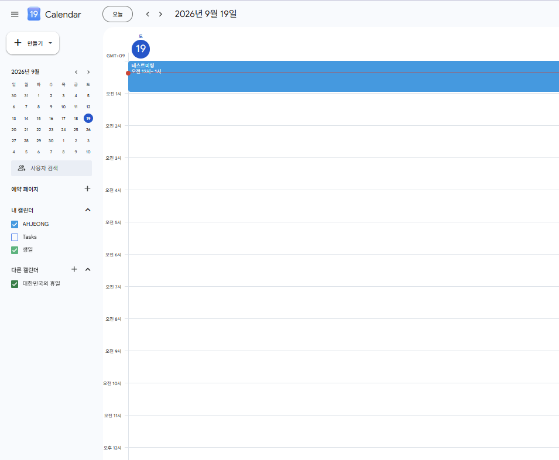
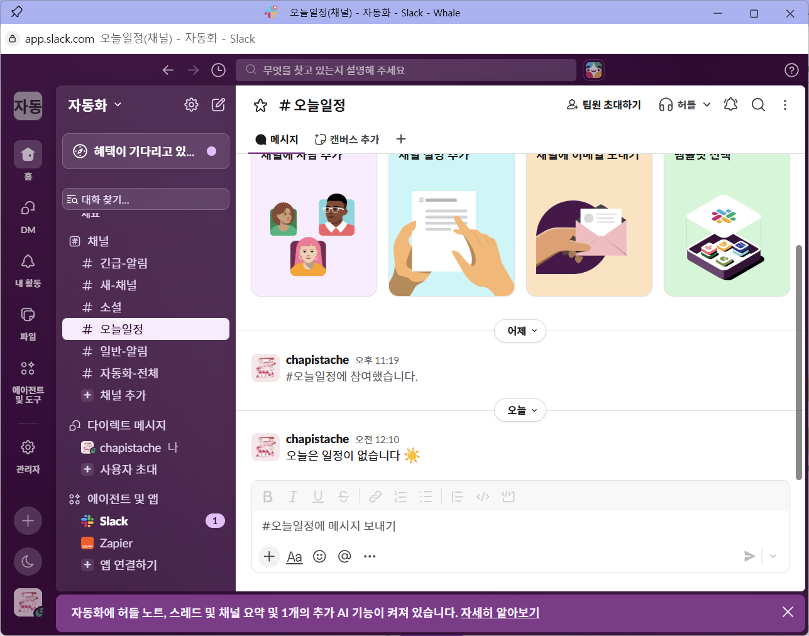
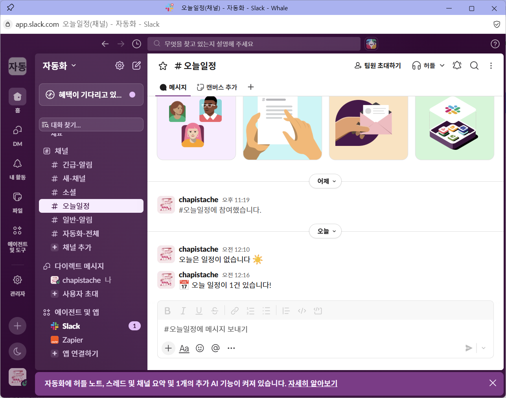

# 프로젝트 2: 자유 주제 자동화 설계 및 구현

## 1. 반복 업무 정의

매일 아침, 오늘 일정이 캘린더에 있는지 일일이 확인하고 팀 채널에 공유하는 일은 사소하지만 매일 반복되는 업무다. 이를 자동화하여, **매일 정해진 시각에 오늘의 구글 캘린더 일정을 확인하고, 일정 유무에 따라 슬랙에 자동으로 브리핑 메시지를 보내는 워크플로우**를 구현했다.

## 2. 선정 도구 및 선정 이유

- **선정 도구**: Make
- **선정 이유**: 프로젝트 1에서 이미 Make의 Router(조건 분기), 모듈 연결 방식에 익숙해진 상태였고, 하나의 캔버스 안에서 시간 기반 트리거부터 조건 분기, 액션까지 전체 흐름을 시각적으로 관리할 수 있었다. 무료 Operations 범위 안에서 매일 1회 실행하는 용도로 충분하다.

## 3. 워크플로우 설계
[Trigger] Basic trigger (스케줄 설정과 함께 사용, 매일 정해진 시각 자동 실행)
↓
[Action 1] Google Calendar – Search Events (오늘 날짜 범위로 일정 검색)
↓
[Action 2] Array Aggregator (검색된 일정을 하나의 배열로 집계)
↓
[Router] 배열 길이(length) 조건으로 분기
├─ 1st 경로 "일정있음" → [Action A] Slack – Send a Message (#오늘일정 채널)
└─ 2nd 경로 "일정없음" → [Action B] Slack – Send a Message (#오늘일정 채널)

### 단계별 설명
1. **Trigger**: Basic trigger를 시작점으로 사용하고, 시나리오 실행 주기를 매일 특정 시각으로 지정해 자동 실행되도록 구성했다.
2. **Google Calendar – Search Events**: 오늘 날짜 범위 안의 일정을 검색한다.
3. **Array Aggregator**: 검색 결과를 배열로 모아, 일정이 0건이어도 이후 Router가 정상적으로 실행되도록 만든다.
4. **Router**: 집계된 배열의 길이를 조건으로 "일정있음" / "일정없음" 두 경로로 분기한다.
5. **Slack 액션**: 분기 결과에 따라 서로 다른 메시지를 슬랙 채널에 전송한다.

## 4. 구현 화면

테스트를 위해 구글 캘린더에 오늘 날짜로 실제 일정("테스트미팅")을 생성했다.

## 5. 실행 결과 화면

**① 일정없음 경로 실행 결과**

**② 일정있음 경로 실행 결과**

두 메시지가 같은 채널에 순서대로 쌓인 것을 통해, **동일한 워크플로우에서 조건에 따라 두 분기 경로가 각각 최소 1회 이상 정상적으로 실행되었음을 확인**할 수 있다.

## 6. 구현 과정 요약

Basic trigger로 시나리오를 시작하고, Google Calendar의 "Search Events" 모듈로 오늘 날짜 범위의 일정을 검색하도록 구성했다. 검색 결과가 0건일 때도 다음 단계가 정상 실행되도록 Array Aggregator를 배치해 결과를 배열로 집계했다. 이후 Router에서 배열 길이를 기준으로 "일정있음"/"일정없음" 두 경로로 나누고, 각 경로 끝에 Slack 메시지 전송 액션을 연결했다. 캘린더에 일정이 없는 상태와 있는 상태를 각각 만들어 테스트하여 두 분기 모두 정상 작동함을 확인했으며, 최종적으로 시나리오 실행 주기를 매일 정해진 시각으로 설정해 자동 실행되도록 마무리했다.

## 7. 사용한 유료 기능 여부
- [x] 없음 (Make 무료 플랜 범위 내에서 완수)
